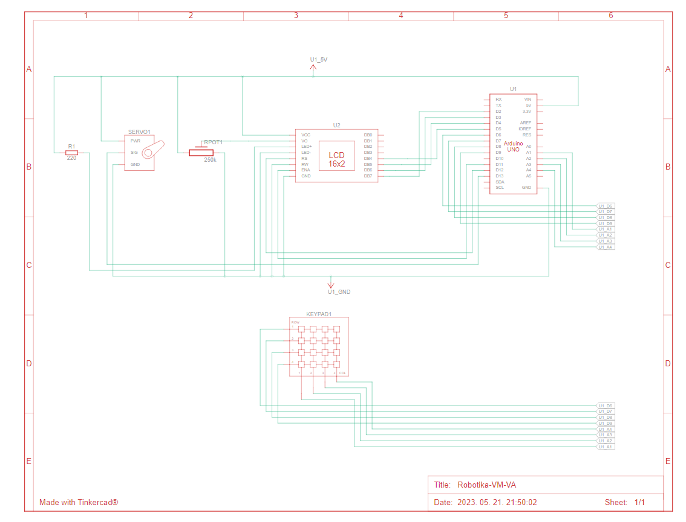
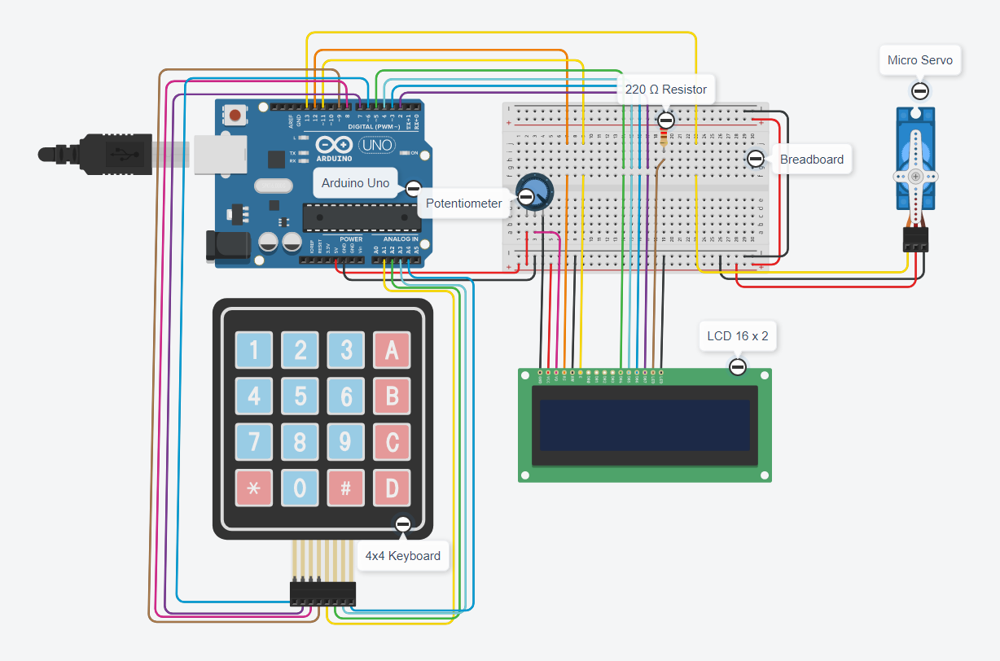
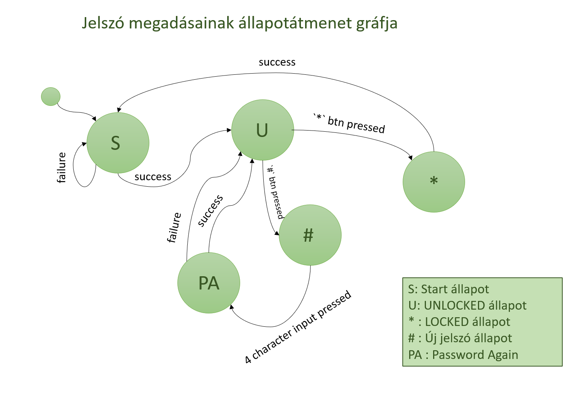
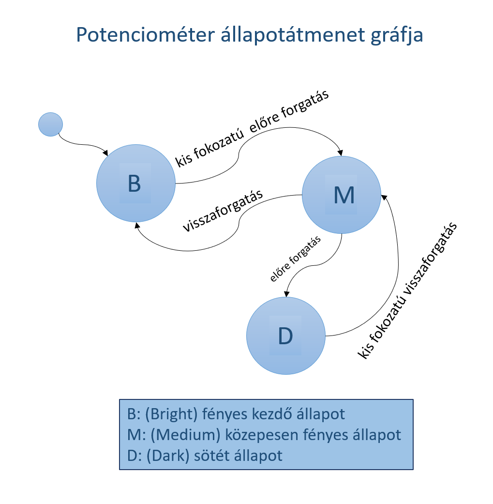

# Funkcionális specifikáció

## 1. Vágyálomrendszer
Elképzeléseink alapján egy futási időben is módosítható biztonsági széf működésének elvét szeretnék megvalósítani. Ennek kivitelezéséhez pedig szükségünk lesz a már ismert komponensek mellet egy "hard-disk" memóriára a jelszavak eltárolásához, illetve változtatásához (EEPROM) és egy micro servo motorra a széf "kinyitásához".

## 2. Alkatrész lista
- 1db Arduino UNO
- 1db LCD kijelző
- 1db 4x4 mátrix billentyűzet
- 1db Micro servo motor
- 1db Forgató potenciométer
- 1db EEPROM
- 1db Breadboard
- 1db 220 Ω ellenállás
- Jumper kábelek

## 3. Használati esetek
- **ENTER PASSWORD**
  - 4 karakteres jelszó beírása a 4x4 mátrix billentyűzeten
  - Alapértelmezetten a jelszó: 1234

- **WELCOME BACK / UNLOCKED**
  - 1 másodpercen keresztül letartott '#' gombbal jelszó változtatás
  - 1 másodpercen keresztül lertartott '*' gombbal lockolás (servo alaphelyzetbe kerül, azaz a széf ajtaja bezárul)

- **SET NEW PASSWORD**
  - új 4 karakterből álló jelszó megadása, majd ennek ismétlése
  - Ha nem egyezik a két jelszó, visszakerül a(z) UNLOCKED státuszba

- **LOCKED**
  - A servo alaphelyzetbe kerül, újra meg kell adni a jelszót

- **Potenciométer forgatása**
  - Alaphelyzetben világos kontraszt az LCD kijelzőn
  - Minimális forgatásra halvány kontraszt az LCD kijelzőn
  - Nagyobb forgatásra teljesen sötét kép az LCD kijelzőn

## 4. Képerenyő tervek
### 4.1 Sematikus rajz

### 4.2 TinkerCAD tervrajz

## 5. Forgatókönyvek
### 5.1 Jelölések
**Jelszó megadásánál**
- Állapotok
    - **S:** Start kezdőállapot
    - **U:** UNLOCKED állapot
    - ***:** LOCKED állapot
    - **#:** Új jelszó állapot
    - **PA:** Password Again állapot

- Állapotátmenetek
    - **success:** siker
    - **failure:** hiba
    - **'*' btn pressed:** * karakter lenyomása
    - **'#' btn pressed:** # karakter lenyomása
    - **4 character input pressed:** 4 karakternyi input lenyomása

**Potenciométer forgatásánál**
- Állapotok 
    - **B:** (Bright) fényes kezdőállapot
    - **M:** (Medium) közepesen fényes állapot
    - **D:** (Dark) sötét állapot

- Állapotátmenetek
    - **kis fokozatú előre forgatás:** 1 egységnyi előre forgatás (TinkerCAD)
    - **kis fokozatú visszaforgatás:** 1 egységnyi visszaforgatás (TinkerCAD)
    - **előre forgatás:** tetszőleges "erősségű" előre forgatás
    - **visszaforgatás:** tetszőleges "erősségű" visszaforgatás

### 5.2 Állapotátmenet gráfok

